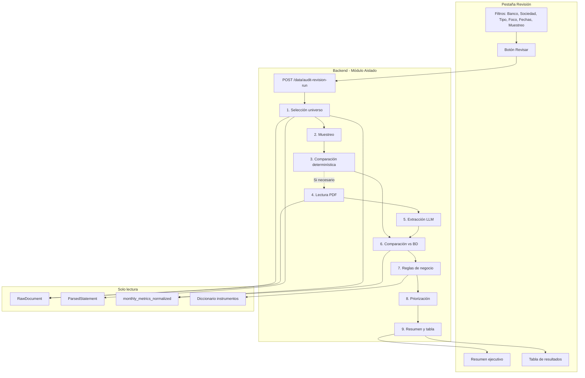

# Plan de construcción: Agente de auditoría "Revisión"

## 1. Resumen ejecutivo de la solución propuesta

El agente es un **módulo de auditoría aislado** que ayuda a priorizar dónde revisar primero comparando montos de cartolas PDF contra la tabla normalizada (`monthly_metrics_normalized`). Opera **100% por el lado**: solo lee, no modifica código, BD, parsers ni flujos existentes. Vive exclusivamente en la pestaña **"Revisión"** dentro de Operacional. Solo corre cuando el usuario pulsa "Revisar".

La estrategia de costos es **escalonada**:
1. **Fase determinística (gratis)**: Compara valores del parser (`ParsedStatement` / `parsed_data_json`) vs normalizado. Detecta desvíos en la cadena parser → loader → normalizada sin usar LLM.
2. **Fase con LLM (opcional, bajo demanda)**: Solo cuando el usuario lo solicita o cuando la fase determinística no puede concluir, se lee el PDF con OpenAI para extraer el monto y comparar contra la BD. Minimiza tokens enviando solo las páginas relevantes según el foco.

**Propuesta sobre muestreo**: En lugar de solo "% de muestra", conviene ofrecer:
- **Límite máximo de documentos** (ej: 50): controla coste y tiempo de forma predecible.
- **Porcentaje de muestra** (10%, 25%, 50%, 100%): útil cuando el universo filtrado es grande.
- **Modo de selección**: "Más recientes primero" (por defecto) vs "Aleatorio". Los más recientes suelen ser más útiles para auditoría operativa.

Recomendación: Usar `min(porcentaje_del_universo, límite_máximo)` para seleccionar documentos. Ejemplo: 100 candidatos, 50%, límite 30 → se revisan 30 (los más recientes).

---

## 2. Arquitectura propuesta



**Separación de responsabilidades**:
- `audit_universe.py`: Query y filtrado del universo (RawDocument + ParsedStatement + Account + MonthlyMetricNormalized).
- `audit_sampling.py`: Lógica de muestreo (% + límite + modo).
- `audit_deterministic.py`: Comparación parser/normalizado sin LLM.
- `audit_pdf_reader.py`: Extracción de texto del PDF (pdfplumber).
- `audit_llm_extractor.py`: Llamada a OpenAI para extraer montos del PDF (solo cuando hace falta).
- `audit_comparator.py`: Comparación valor extraído vs valor normalizado, tolerancias.
- `audit_business_rules.py`: Aplicación de reglas conocidas (beginning/prev_ending, YTD BBH).
- `audit_priority.py`: Cálculo de prioridad (diferencia, ambigüedad).
- `audit_report_builder.py`: Construcción del resumen ejecutivo y la tabla.
- `audit_service.py`: Orquestador que coordina los módulos.

---

## 3. Lista de archivos a crear o modificar

### Crear

| Archivo | Justificación |
|---------|---------------|
| `backend/services/audit/audit_universe.py` | Selección del universo a revisar según filtros. |
| `backend/services/audit/audit_sampling.py` | Muestreo según % y límite. |
| `backend/services/audit/audit_deterministic.py` | Comparación parser vs normalizado sin LLM. |
| `backend/services/audit/audit_pdf_reader.py` | Lectura de texto PDF. |
| `backend/services/audit/audit_llm_extractor.py` | Extracción de montos con OpenAI. |
| `backend/services/audit/audit_comparator.py` | Comparación y tolerancias. |
| `backend/services/audit/audit_business_rules.py` | Reglas beginning/prev_ending, YTD BBH. |
| `backend/services/audit/audit_priority.py` | Cálculo de prioridad. |
| `backend/services/audit/audit_report_builder.py` | Resumen y tabla. |
| `backend/services/audit/audit_service.py` | Orquestador. |
| `backend/routers/audit.py` | Endpoint POST /data/audit-revision-run. |

### Modificar (mínimo, aditivo)

| Archivo | Cambio |
|---------|--------|
| `backend/main.py` | `include_router(audit)` |
| `frontend/pages/operational.py` | Nueva pestaña "Revisión" (Operacional tendrá tabs: Salud BD, Revisión). |
| `frontend/api_client.py` | `run_audit_revision(params)` |
| `backend/schemas.py` | `AuditRevisionParams`, `AuditRevisionResponse` |
| `pyproject.toml` | `openai` si no existe |

### No se toca

- Parsers, `data_loading_service`, `_build_health_report`, modelos, capa normalizada, otras pestañas.

---

### 3.1 Aportes y retiros vs movimientos netos (decisión de alcance)

**Estado actual en la app:** En la capa normalizada solo existe el **movimiento neto** (`movements_net` / equivalente en `parsed_data`), no hay columnas separadas de "aportes" ni "retiros" persistidas.

**¿Hay que especificarlo ya o puede ser después?**

- **No bloquea la v1 del agente.** La v1 puede implementar focos que **sí tienen contraparte en BD**: valor de cierre, movimientos netos, caja, instrumentos (según diccionario y datos disponibles).
- **Aportes y retiros como focos separados** pueden quedar en **fase 2**, cuando existan campos en normalized o reglas claras de extracción en el parser, **o** cuando se defina un modo de auditoría solo-PDF (ver abajo).

**¿El agente puede "encontrar" aportes y retiros de todos modos?**

- **En el PDF (con LLM):** Sí puede intentar extraer montos si la cartola los muestra (ej. "Net Contributions", "Withdrawals"). Eso sirve para **lectura de apoyo** o para mostrar "según el PDF, aportes X, retiros Y" **sin** comparar contra un valor separado en BD.
- **Comparación determinística parser vs BD:** No hay dos columnas en BD; **no se puede** auditar "aportes PDF vs aportes BD" hasta que existan esos campos (o un criterio acordado en `parsed_data_json`).
- **Conclusión práctica:** Para v1, el foco unificado **"Movimientos netos"** cubre lo que hoy persiste la app. Las opciones UI "Aportes" y "Retiros" pueden: (a) no mostrarse hasta fase 2, o (b) mostrarse solo si `use_llm=True` con texto tipo nota: *"Solo lectura desde el PDF; no hay monto comparable en base de datos por separado"*.

---

## 4. Diseño de backend

### Endpoint

**POST `/data/audit-revision-run`**

### Parámetros de entrada

```python
class AuditRevisionParams(BaseModel):
    bank_codes: list[str] = []
    entity_names: list[str] = []      # Sociedad
    account_types: list[str] = []
    focus: str = "valor_cierre"       # valor_cierre | movimientos_netos | aportes | retiros | instrumentos | caja
                                    # aportes/retiros: fase 2 o solo modo LLM sin comparación BD (ver 3.1)
    year_start: Optional[int] = None
    year_end: Optional[int] = None
    month_start: Optional[int] = None
    month_end: Optional[int] = None
    sample_pct: int = 25              # 10, 25, 50, 100
    max_docs: int = 50                 # Límite máximo
    sample_mode: str = "recentes"     # "recentes" | "aleatorio"
    use_llm: bool = False             # True = también validar contra PDF con LLM
```

### Flujo

1. Validar `OPENAI_API_KEY` si `use_llm=True`.
2. `audit_universe`: Query RawDocument (file_type=pdf_cartola) + ParsedStatement + Account. Filtrar por bank_codes, entity_names, account_types, rango fechas. Ordenar por period_year desc, period_month desc.
3. `audit_sampling`: Aplicar `sample_pct` y `max_docs`. Si modo "recentes", tomar los primeros N; si "aleatorio", shuffle y tomar N.
4. Por cada documento seleccionado:
   - `audit_deterministic`: Obtener valor del parser y del normalizado según `focus`. Comparar. Si hay diferencia o no se puede comparar → registrar hallazgo.
   - Si `use_llm`: `audit_pdf_reader` extrae texto, `audit_llm_extractor` pide al modelo el monto del PDF. `audit_comparator` compara contra normalizado.
5. `audit_business_rules`: Para cada hallazgo, verificar si aplica regla conocida (beginning/prev_ending, YTD BBH) y anotar en `nota`.
6. `audit_priority`: Calcular prioridad.
7. `audit_report_builder`: Construir resumen y tabla (solo filas con diferencia).
8. Devolver respuesta.

### Contratos de entrada/salida

**Response**:

```python
class AuditRevisionResponse(BaseModel):
    total_candidatos: int
    revisados: int
    resumen: AuditRevisionSummary
    hallazgos: list[AuditRevisionHallazgo]  # Solo con diferencia != 0

class AuditRevisionSummary(BaseModel):
    documentos_revisados: int
    pct_con_diferencias: float
    pct_ambiguos: float
    pct_no_auditables: float
    top_bancos_incidencias: list[dict]   # [{"banco": "JPMorgan", "cantidad": 5}, ...]
    top_parsers_incidencias: list[dict] # [{"parser": "jpmorgan brokerage", "cantidad": 4}, ...]

class AuditRevisionHallazgo(BaseModel):
    sociedad: str
    banco: str
    tipo_cuenta: str
    id_cuenta: str
    elemento_revisado: str    # "Valor de cierre", "Movimientos netos", etc.
    monto_agente: Optional[float]
    monto_bd: Optional[float]
    diferencia: float
    diferencia_pct: Optional[float]
    nivel: str               # "alta" | "media" | "baja" | "ambiguo" | "no_auditable"
    nota: str
    prioridad: float         # Para orden por defecto
```

---

## 5. Diseño de la pestaña "Revisión"

### Filtros (lenguaje usuario)

- **Banco**: select, vacío = todos.
- **Sociedad**: multiselect, vacío = todas.
- **Tipo de cuenta**: select, vacío = todos.
- **Foco**: select con opciones (v1 mínimo en negrita):
  - **Valor de cierre**
  - **Movimientos netos** (equivale al neto aportes/retiros que ya persiste la app)
  - Aportes (solo fase 2 o modo LLM sin comparación BD separada — ver sección 3.1)
  - Retiros (idem)
  - **Monto instrumentos (diccionario)**
  - **Caja**
- **Rango de fechas**: desde año-mes hasta año-mes (dos select o date_input).
- **Porcentaje de muestra**: 10%, 25%, 50%, 100%.
- **Límite máximo de documentos**: número, default 50.
- **Modo de selección**: "Más recientes primero" | "Aleatorio".
- **Validar contra PDF (LLM)**: checkbox, default false (solo determinístico).

### Botón

"Revisar" — deshabilita filtros durante la ejecución, muestra spinner, al terminar muestra resultado.

### Resumen ejecutivo

- Documentos revisados: N
- % con diferencias: X%
- % ambiguos: Y%
- % no auditables: Z%
- Top bancos con incidencias: lista corta
- Top parsers con incidencias: lista corta

### Tabla de resultados

Columnas (lenguaje usuario):

- Sociedad
- Banco
- Tipo de cuenta
- Id (cuenta)
- Elemento revisado
- Monto leído por el agente
- Monto en base de datos
- Diferencia
- Nivel (alta/media/baja/ambiguo/no auditable)
- Nota

**Ordenación**: Por defecto por prioridad (diferencia mayor primero). El usuario puede ordenar por cualquier columna (Streamlit `st.dataframe` con `column_config` permite ordenar).

**Solo se muestran filas con diferencia** (o ambiguas / no auditables). Si no hay hallazgos: mensaje "No se encontraron diferencias ni casos ambiguos en la muestra revisada."

### Estados posibles

- **Inicial**: Filtros visibles, botón habilitado, sin resultado.
- **Ejecutando**: Spinner, botón deshabilitado.
- **Éxito con hallazgos**: Resumen + tabla.
- **Éxito sin hallazgos**: Mensaje informativo.
- **Error** (ej: sin API key cuando use_llm): Mensaje claro sin tecnicismos.

---

## 6. Lógica de priorización de hallazgos

**Fórmula de prioridad**:

```
Si nivel == "no_auditable": prioridad = -1 (al final)
Si nivel == "ambiguo": prioridad = 0.5 * max_prioridad_diferencias (entre diferencias y ambiguos)
Si hay diferencia:
  prioridad = abs(diferencia) + (diferencia_pct * 1000)   # cuando diferencia_pct existe
  prioridad = abs(diferencia)                             # cuando no
```

Orden por defecto: mayor prioridad primero. Los "no auditable" al final. Los "ambiguo" entre medias y bajas.

**Niveles**:
- **Alta**: diferencia > 1% del monto o diferencia absoluta > umbral significativo (ej: 10.000 USD).
- **Media**: diferencia entre 0.1% y 1%, o diferencia absoluta moderada.
- **Baja**: diferencia < 0.1%.
- **Ambiguo**: el documento no permitió conclusión clara.
- **No auditable**: el documento no contenía el dato buscado o no fue legible.

---

## 7. Integración de reglas de negocio ya conocidas

### Regla 1: Beginning value vs prev_ending_value

Cuando: `beginning` de la cartola actual != `prev_ending_value` del período anterior.  
Acción: No marcar como hallazgo crítico. En la `nota` del hallazgo (si existe por otro motivo) añadir: "Beginning value de la cartola no coincide con el valor de cierre anterior; por regla conocida prevalece el ending value auditado."

Si el único "problema" detectado es esta discrepancia: **no incluir en la tabla de hallazgos** (es esperado).

### Regla 2: YTD BBH incluye prior adjustments

Cuando: Banco BBH y hay diferencia en `movements_ytd`.  
Acción: Verificar si la diferencia coincide con `prior_period_adjustments` en el documento. Si aplica, en la `nota` añadir: "YTD BBH incluye prior adjustments; la diferencia podría explicarse por ello." No suprimir el hallazgo pero bajar nivel a "baja" si cuadra.

Implementación: `audit_business_rules.py` recibe el hallazgo y el contexto (banco, tipo de documento, parsed_data) y devuelve el hallazgo con `nota` enriquecida y nivel ajustado.

---

## 8. Estrategia de costos

| Fase | Costo | Cuándo |
|------|-------|--------|
| Determinística | $0 | Siempre, para todos los documentos muestreados. |
| LLM | ~$0.03–0.05/doc | Solo si `use_llm=True` y solo para los documentos en la muestra. |

**Recomendación**:
- Por defecto `use_llm=False`. La fase determinística ya detecta la mayoría de desvíos (parser vs normalizado).
- Habilitar LLM cuando se quiera validar contra la fuente (PDF) en un subconjunto pequeño (ej: 10–20 docs).
- Limitar `max_docs` a 30–50 para mantener coste predecible.

---

## 9. Persistencia de resultados de auditoría

**Recomendación: NO persistir** por defecto.

- El agente es solo lectura; persisten los datos normalizados.
- Los resultados de auditoría son efímeros: sirven para guiar la revisión humana en ese momento.
- Persistir implicaría nueva tabla, migraciones, y posible confusión sobre "otra fuente de verdad".
- Si el usuario quiere conservar el reporte, puede exportarlo manualmente (CSV/Excel) desde la UI — fuera del scope inicial.

**Excepción futura**: Si más adelante se quiere "historial de auditorías" o "tendencias", se podría añadir una tabla opcional `audit_revision_runs` que guarde metadatos (fecha, filtros, resumen) sin los detalles de cada hallazgo, para estadísticas. No recomendado en v1.

---

## 10. Formato exacto del resultado de auditoría (backend)

```json
{
  "total_candidatos": 120,
  "revisados": 30,
  "resumen": {
    "documentos_revisados": 30,
    "pct_con_diferencias": 6.67,
    "pct_ambiguos": 3.33,
    "pct_no_auditables": 0,
    "top_bancos_incidencias": [
      {"banco": "JPMorgan", "cantidad": 2},
      {"banco": "UBS Suiza", "cantidad": 1}
    ],
    "top_parsers_incidencias": [
      {"parser": "jpmorgan brokerage", "cantidad": 2}
    ]
  },
  "hallazgos": [
    {
      "sociedad": "Boatview",
      "banco": "JPMorgan",
      "tipo_cuenta": "brokerage",
      "id_cuenta": "1412600",
      "elemento_revisado": "Valor de cierre",
      "monto_agente": 21836455.12,
      "monto_bd": 21836000.00,
      "diferencia": 455.12,
      "diferencia_pct": 0.002,
      "nivel": "baja",
      "nota": "Diferencia de 455.12 USD (0.002%). Revisar redondeos en página de resumen.",
      "prioridad": 455.12
    }
  ]
}
```

---

## 11. Plan de tests

### Unitarios

- `audit_universe`: Con DB fixture, filtrar por bank/entity/type/fechas, verificar conteo y que solo pdf_cartola.
- `audit_sampling`: Dado lista de N docs, sample_pct y max_docs, verificar tamaño resultante y que no exceda límites.
- `audit_deterministic`: Dado parser payload y normalized payload, verificar detección de diferencias según focus.
- `audit_business_rules`: Dado hallazgo con banco BBH y diff YTD, verificar que nota incluye "prior adjustments" cuando aplica.
- `audit_priority`: Dado lista de hallazgos, verificar orden por prioridad.

### Integración

- Endpoint `POST /data/audit-revision-run` con DB fixture y documentos de prueba: verificar schema de respuesta, que no se escribe en BD, y que hallazgos tienen estructura correcta.
- Con `use_llm=True` y mock de OpenAI: verificar que se llama al modelo y que el resultado se integra en hallazgos.

### Casos borde

- Universo vacío: respuesta con revisados=0, hallazgos=[], resumen coherente.
- Sin OPENAI_API_KEY y use_llm=True: error 400 o 503 con mensaje claro.
- Documento sin parsed_data_json: marcar como "no auditable" con nota apropiada.
- Documento sin fila en normalized: marcar como "no auditable" o "falta dato en BD".
- Diferencias por redondeo (ej: 0.01): definir tolerancia (ej: 0.01 USD o 0.001%) y no marcar como hallazgo si está dentro.

---

## 12. Riesgos y debilidades

| Riesgo | Mitigación |
|--------|------------|
| LLM extrae mal un monto | Prompt muy acotado; solicitar solo número y ubicación en PDF; tolerancia para redondeos. |
| PDF no legible o formato nuevo | Marcar "no auditable" con nota clara; no intentar forzar conclusión. |
| Coste inesperado con use_llm | Límite máximo de docs obligatorio; default use_llm=False. |
| Aportes/retiros separados sin columnas en BD | v1: usar solo "Movimientos netos"; aportes/retiros como foco en fase 2 o solo extracción PDF con nota explícita (sección 3.1). |
| Instrumentos del diccionario: estructura varía por banco | Usar asset_taxonomy / Excel para nombres; comparar total por bucket cuando aplica; documentar limitaciones por banco. |

**Debilidades conocidas**:
- La fase determinística compara parser vs normalizado, no PDF vs normalizado. Solo con LLM se valida contra fuente. El parser puede estar equivocado y normalizado correcto respecto al PDF (caso raro).
- Aportes/retiros: ver sección 3.1; v1 prioriza "Movimientos netos"; desglose separado cuando haya datos o modo LLM informativo.

---

## 13. Recomendaciones finales

1. **Implementar en orden**: universo → muestreo → determinístico → reglas de negocio → prioridad → reporte. Añadir LLM después de validar el flujo base.
2. **Foco inicial**: Empezar con "valor_cierre" y "movimientos" que están bien definidos en normalized. Aportes/retiros e instrumentos en fase 2 según disponibilidad por parser.
3. **Tolerancia numérica**: Definir umbral (ej: diff < 0.01 USD o < 0.001%) bajo el cual no se considera hallazgo.
4. **Nomenclatura en UI**: Usar "Elemento revisado" como columna; valores: "Valor de cierre", "Movimientos netos", "Caja", "Instrumentos (diccionario)"; "Aportes" / "Retiros" solo cuando el alcance de la sección 3.1 lo permita.
5. **Aportes/retiros**: No es obligatorio implementarlos en la primera entrega. La comparación contra BD para esos conceptos requiere datos persistidos por separado o acuerdo explícito de qué campo del JSON del parser usar; hasta entonces, "Movimientos netos" es el foco alineado con la app actual.

---

## 14. Texto para actualizar archivos de contexto

**Para AGENT_CONTEXT.md** (agregar en sección apropiada):

```
- Operacional tiene dos pestañas: Salud BD y Revisión. La pestaña Revisión ejecuta un agente de auditoría que compara montos de cartolas vs tabla normalizada. El agente es solo lectura, vive aislado, y solo corre cuando el usuario pulsa "Revisar". No modifica BD ni flujos críticos.
```

**Para SESSION_STATE.md** (agregar handoff cuando se implemente):

```
- Agente de auditoría "Revisión": nueva pestaña en Operacional. Filtros Banco, Sociedad, Tipo, Foco, Fechas, Muestreo. Comparación determinística (parser vs normalized) y opcionalmente LLM para validar contra PDF. Reglas de negocio integradas: beginning/prev_ending, YTD BBH prior adjustments. Resumen ejecutivo + tabla de hallazgos ordenable.
```
